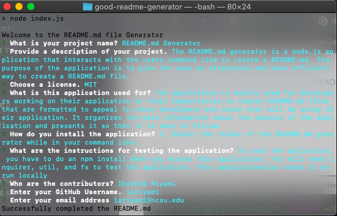

  # README.md Generator

  # Table of Contents

  * [Description](#description)
  * [License](#license)
  * [Usage](#usage)
  * [Installation](#installation)
  * [Test](#test)
  * [Contributors](#contributors)
  * [Contact](#contact)
  * [Credits](#credits)

  # **Description**
  * The README.md generator is a node.js application that interacts with the users command line to create a README.md. The purpose of the application is to give the user an alternaive and more efficient way to create a README.md file.

  # **License**
  * >  

  # **Usage** 
  * The application is mainly used for developers working on their application in their repositories to create README.md files that are formatted to appeal to other developers and users that will be using their application. It organizes the main information about the aspects of the application and presents it so that it is easy to follow.

  # Screenshot
  This is a screenshot of the working application.

  

  # **Installation**   
  * 1. Select the folder of the README.md generator while in your command line.

  # **Test**
  * To test the aplication, you have to do an npm install when you access this application. You will need inquirer, util, and fs to test the application. This applicationalso needs to be run locally

  # **Contributors**
  * Ibrahim Riyami

  # **Contact**
  * https://github.com/iariyami

  * iariyami@ncsu.edu
